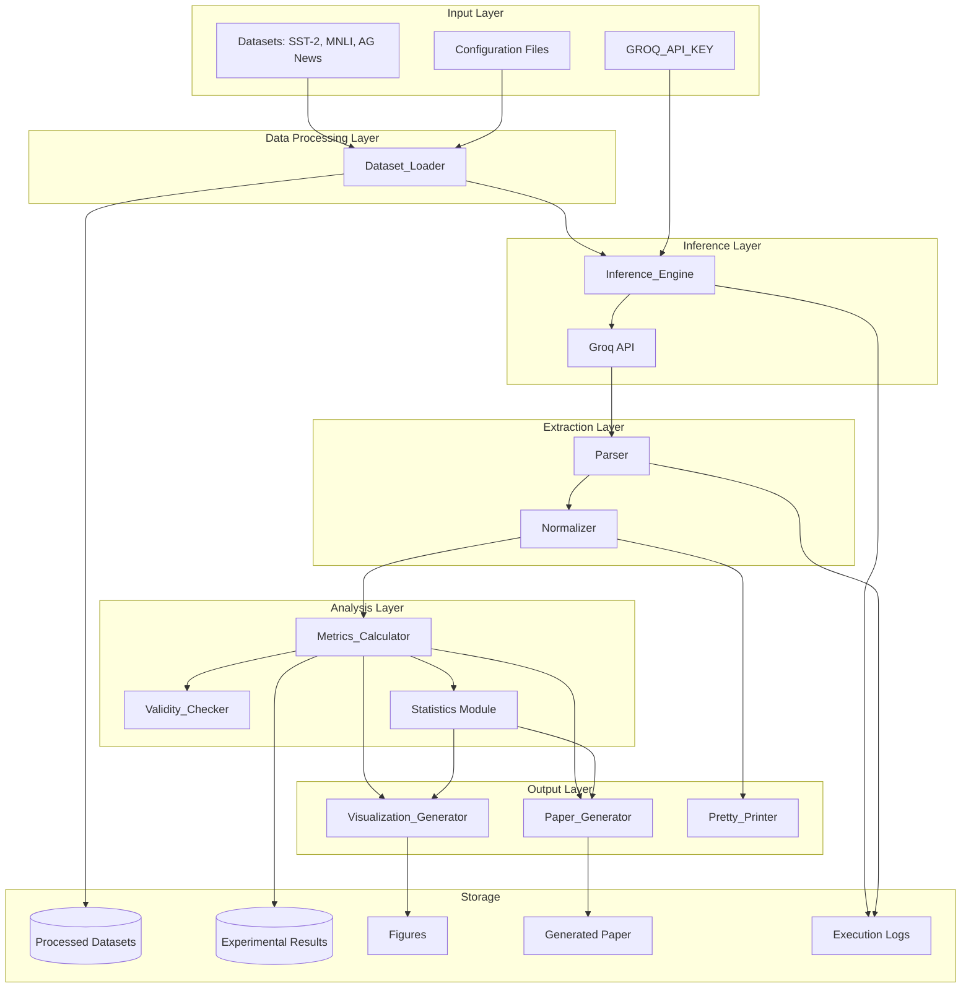
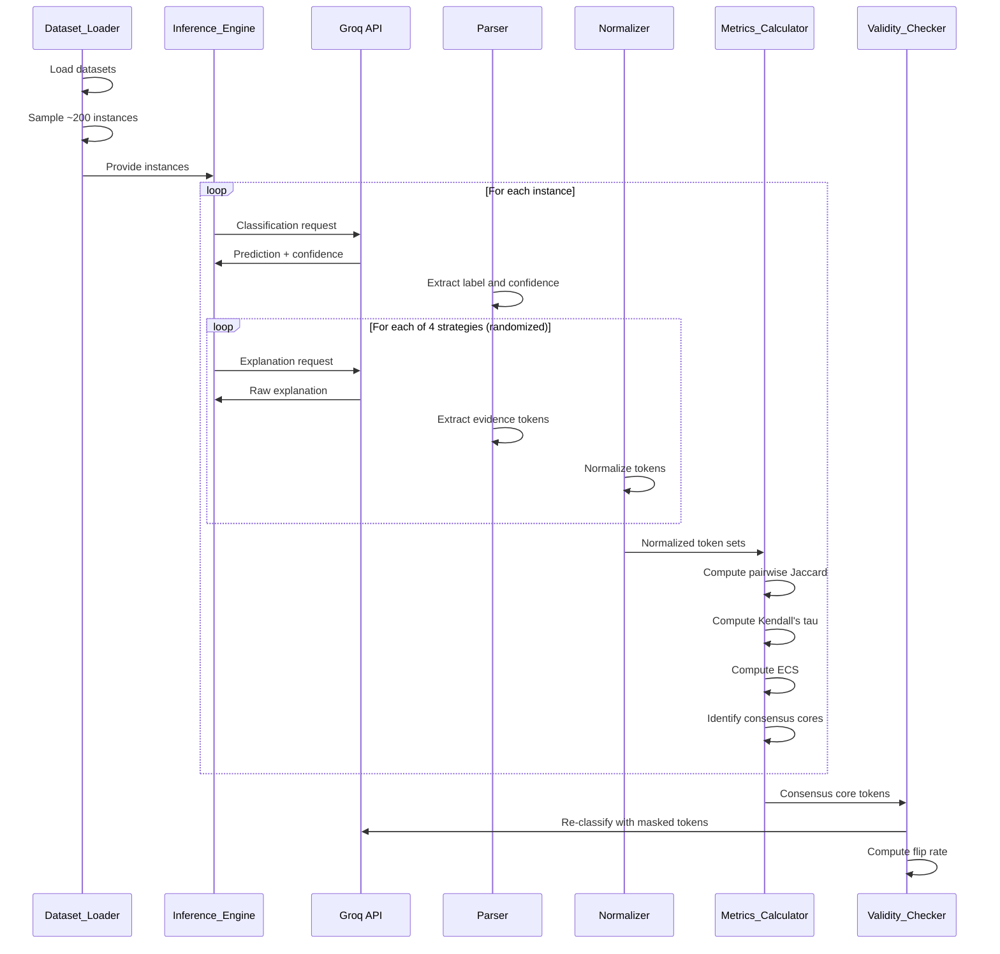

# Design Document

## Overview

The LLM Explanation Agreement Study is a research pipeline that investigates whether cross-strategy agreement among LLM self-explanations can serve as a reliability signal for model predictions. The system executes controlled experiments across three NLP datasets (SST-2, MNLI, AG News), three Groq-compatible language models, and four explanation strategies (token highlighting, rationale generation, counterfactual generation, and rank-ordering).

The pipeline follows a multi-stage architecture:
1. **Data Preparation**: Load and sample datasets with balanced label distribution
2. **Model Inference**: Execute classification and explanation requests via Groq API
3. **Parsing**: Extract structured evidence from raw model outputs
4. **Normalization**: Standardize tokens for cross-strategy comparison
5. **Metrics Computation**: Calculate pairwise agreement, ECS, and consensus cores
6. **Validity Testing**: Validate that high-consensus evidence is causally important
7. **Statistical Analysis**: Compute correlations, significance tests, and confidence intervals
8. **Visualization**: Generate publication-quality figures
9. **Paper Generation**: Produce a first-draft research paper with all sections

The system is designed for reproducibility, with deterministic model settings (temperature=0), comprehensive logging, checkpointing for long-running experiments, and extensive automated testing.

## Architecture

### System Architecture Diagram



### Component Interaction Flow



### Technology Stack

- **Language**: Python 3.9+
- **LLM API**: Groq API with deterministic settings (temperature=0, top_p=1)
- **Data Loading**: Hugging Face `datasets` library
- **NLP Processing**: NLTK or spaCy for tokenization, stopword removal, lemmatization
- **Metrics**: NumPy, SciPy for statistical computations
- **Visualization**: Matplotlib, Seaborn for publication-quality figures
- **Testing**: pytest with property-based testing via Hypothesis
- **Logging**: Python logging module with structured output
- **Configuration**: YAML or JSON configuration files

## Components and Interfaces

### 1. Dataset_Loader

**Responsibility**: Load datasets from Hugging Face, perform balanced sampling, and export to structured format.

**Interface**:
```python
class DatasetLoader:
    def load_dataset(self, dataset_name: str) -> Dataset:
        """Load dataset from Hugging Face or cache."""
        
    def sample_balanced(self, dataset: Dataset, n_samples: int) -> List[Instance]:
        """Sample approximately n instances with balanced label distribution."""
        
    def export_to_file(self, instances: List[Instance], output_path: Path) -> None:
        """Export sampled dataset to structured file."""
        
    def compute_statistics(self, instances: List[Instance]) -> DatasetStats:
        """Compute label distribution and text length statistics."""
```

**Inputs**:
- Dataset name (string): "sst2", "mnli", "ag_news"
- Sample size (integer): target number of instances (~200)
- Configuration (dict): sampling parameters

**Outputs**:
- Structured dataset file (JSON/JSONL) with fields:
  - `instance_id`: unique identifier
  - `text`: input text
  - `label`: ground truth label
  - `dataset`: source dataset name
  - `split`: train/validation/test

**Key Algorithms**:
- **Balanced Sampling**: Use stratified sampling to ensure proportional representation of all labels
  1. Group instances by label
  2. Calculate target samples per label: n_samples / n_labels
  3. Randomly sample from each label group
  4. If exact balance not possible, adjust to nearest balanced distribution

### 2. Inference_Engine

**Responsibility**: Execute all model inference requests via Groq API with retry logic and rate limiting.

**Interface**:
```python
class InferenceEngine:
    def __init__(self, api_key: str, model_name: str):
        """Initialize with API credentials and model selection."""
        
    def classify(self, text: str) -> ClassificationResult:
        """Get classification prediction with confidence score."""
        
    def explain(self, text: str, strategy: ExplanationStrategy, 
                task_context: dict) -> ExplanationResult:
        """Get explanation using specified strategy."""
        
    def classify_with_mask(self, text: str, masked_tokens: Set[str]) -> ClassificationResult:
        """Get classification with specific tokens masked."""
        
    def _make_request(self, prompt: str, max_retries: int = 3) -> str:
        """Execute API request with exponential backoff retry logic."""

@dataclass
class ClassificationResult:
    predicted_label: str
    confidence: float
    raw_response: str
    timestamp: datetime

@dataclass
class ExplanationResult:
    strategy: ExplanationStrategy
    raw_response: str
    timestamp: datetime
```

**API Configuration**:
- **Endpoint**: Groq API chat completions endpoint
- **Authentication**: GROQ_API_KEY environment variable
- **Model Settings** (deterministic):
  - `temperature`: 0
  - `top_p`: 1
  - `max_tokens`: 512 for explanations, 50 for classification
- **Retry Policy**: Exponential backoff with base 2 seconds, max 3 retries
- **Rate Limiting**: Respect Groq API limits (implementation depends on tier)

**Concurrency**: Support concurrent requests up to API limit using `asyncio` or thread pool

### 3. Parser

**Responsibility**: Extract structured evidence from raw model outputs for all explanation strategies.

**Interface**:
```python
class Parser:
    def parse_classification(self, raw_response: str, label_set: List[str]) -> Tuple[str, float]:
        """Extract predicted label and confidence score."""
        
    def parse_highlighting(self, raw_response: str) -> List[str]:
        """Extract exactly 3 highlighted tokens."""
        
    def parse_rationale(self, raw_response: str) -> str:
        """Extract one-sentence rationale."""
        
    def parse_counterfactual(self, raw_response: str) -> str:
        """Extract minimal-edit counterfactual text."""
        
    def parse_rank_ordering(self, raw_response: str) -> List[Tuple[str, int]]:
        """Extract 5 tokens with their rank positions."""
        
    def _fuzzy_extract(self, pattern: str, text: str) -> Optional[str]:
        """Attempt fuzzy matching if exact extraction fails."""
```

**Parsing Strategies**:

1. **Classification Parsing**:
   - Regular expressions for common formats: "Prediction: {label}, Confidence: {score}"
   - Fuzzy matching for label names (handle case variations, typos)
   - Confidence extraction: parse integers 0-100 or floats 0.0-1.0

2. **Highlighting Parsing**:
   - Pattern matching for: numbered lists, quoted tokens, comma-separated tokens
   - Take first 3 tokens if more provided
   - Handle partial responses (< 3 tokens) with logging

3. **Rationale Parsing**:
   - Extract first complete sentence after prompt
   - Handle cases where model provides explanation before or after rationale

4. **Counterfactual Parsing**:
   - Pattern matching for "Original:" and "Counterfactual:" sections
   - Handle inline counterfactuals in natural language responses

5. **Rank-Ordering Parsing**:
   - Pattern matching for numbered lists with ranks 1-5
   - Handle natural language descriptions: "Most important: X, Second: Y..."
   - Extract (token, rank) pairs

### 4. Normalizer

**Responsibility**: Standardize extracted tokens for cross-strategy comparison.

**Interface**:
```python
class Normalizer:
    def __init__(self, use_lemmatization: bool = True, 
                 remove_stopwords: bool = True):
        """Initialize with normalization configuration."""
        
    def normalize_tokens(self, tokens: List[str]) -> Set[str]:
        """Apply normalization pipeline to token list."""
        
    def extract_content_words_from_rationale(self, rationale: str) -> Set[str]:
        """Tokenize rationale and extract content words."""
        
    def extract_counterfactual_diff(self, original: str, counterfactual: str) -> Set[str]:
        """Identify tokens that differ between original and counterfactual."""
        
    def _lowercase(self, token: str) -> str:
        """Convert to lowercase."""
        
    def _remove_punctuation(self, token: str) -> str:
        """Strip punctuation characters."""
        
    def _lemmatize(self, token: str) -> str:
        """Apply lemmatization if enabled."""
```

**Normalization Pipeline**:
1. **Lowercase**: Convert all tokens to lowercase
2. **Punctuation Removal**: Strip leading/trailing punctuation, preserve hyphens in compound words
3. **Stopword Removal** (optional): Remove common stopwords using NLTK or spaCy stopword list
4. **Lemmatization** (optional): Reduce words to base form (e.g., "running" → "run")

**Counterfactual Diff Algorithm**:
```python
def extract_counterfactual_diff(original: str, counterfactual: str) -> Set[str]:
    original_tokens = tokenize(original)
    cf_tokens = tokenize(counterfactual)
    
    deleted_tokens = set(original_tokens) - set(cf_tokens)
    added_tokens = set(cf_tokens) - set(original_tokens)
    
    diff_tokens = deleted_tokens | added_tokens
    return normalize_tokens(diff_tokens)
```

**Versioning**: Normalization configuration is versioned and logged with each experiment run

### 5. Metrics_Calculator

**Responsibility**: Compute all agreement metrics, consensus scores, and statistical analyses.

**Interface**:
```python
class MetricsCalculator:
    def compute_jaccard_similarity(self, set1: Set[str], set2: Set[str]) -> float:
        """Compute Jaccard similarity between two token sets."""
        
    def compute_kendalls_tau(self, ranks1: List[Tuple[str, int]], 
                             ranks2: List[Tuple[str, int]]) -> float:
        """Compute Kendall's tau rank correlation."""
        
    def compute_pairwise_agreements(self, explanations: Dict[str, Set[str]]) -> Dict[Tuple[str, str], float]:
        """Compute agreement for all strategy pairs."""
        
    def compute_ecs(self, pairwise_agreements: Dict[Tuple[str, str], float]) -> float:
        """Compute Explanation Consensus Score as mean pairwise agreement."""
        
    def compute_consensus_core(self, explanations: Dict[str, Set[str]], k: int) -> Set[str]:
        """Compute CCk: tokens appearing in at least k strategies."""
        
    def compute_confidence_ecs_correlation(self, confidences: List[float], 
                                          ecs_values: List[float]) -> CorrelationResult:
        """Compute Spearman correlation with confidence intervals."""
```

**Key Algorithms**:

#### Jaccard Similarity
```python
def jaccard_similarity(set1: Set[str], set2: Set[str]) -> float:
    if len(set1) == 0 and len(set2) == 0:
        return 1.0  # Empty sets are identical
    intersection = set1 & set2
    union = set1 | set2
    return len(intersection) / len(union) if len(union) > 0 else 0.0
```

#### Kendall's Tau with Implicit Ranks
For strategies that don't provide explicit ranks, assign ranks based on token order:
```python
def assign_implicit_ranks(tokens: List[str]) -> List[Tuple[str, int]]:
    return [(token, i+1) for i, token in enumerate(tokens)]

def compute_kendalls_tau(ranks1, ranks2):
    # Find common tokens
    common_tokens = set([t for t, _ in ranks1]) & set([t for t, _ in ranks2])
    
    # Create rank vectors for common tokens
    rank_vec1 = [r for t, r in ranks1 if t in common_tokens]
    rank_vec2 = [r for t, r in ranks2 if t in common_tokens]
    
    # Use scipy.stats.kendalltau
    tau, p_value = scipy.stats.kendalltau(rank_vec1, rank_vec2)
    return tau
```

#### ECS Calculation
```python
def compute_ecs(pairwise_agreements):
    # All 6 pairwise comparisons: H-R, H-CF, H-RO, R-CF, R-RO, CF-RO
    strategy_pairs = [
        ('H', 'R'), ('H', 'CF'), ('H', 'RO'),
        ('R', 'CF'), ('R', 'RO'), ('CF', 'RO')
    ]
    
    agreements = [pairwise_agreements[pair] for pair in strategy_pairs]
    return np.mean(agreements)
```

#### Consensus Core Identification
```python
def compute_consensus_core(explanations, k):
    # Count occurrences of each token across all strategies
    token_counts = defaultdict(int)
    for strategy, tokens in explanations.items():
        for token in tokens:
            token_counts[token] += 1
    
    # Select tokens appearing in at least k strategies
    cc_k = {token for token, count in token_counts.items() if count >= k}
    return cc_k
```

#### Spearman Correlation with Bootstrap CI
```python
def compute_confidence_ecs_correlation(confidences, ecs_values, n_bootstrap=1000):
    # Compute observed correlation
    rho, p_value = scipy.stats.spearmanr(confidences, ecs_values)
    
    # Bootstrap confidence interval
    bootstrap_rhos = []
    for _ in range(n_bootstrap):
        indices = np.random.choice(len(confidences), len(confidences), replace=True)
        boot_conf = [confidences[i] for i in indices]
        boot_ecs = [ecs_values[i] for i in indices]
        boot_rho, _ = scipy.stats.spearmanr(boot_conf, boot_ecs)
        bootstrap_rhos.append(boot_rho)
    
    ci_lower = np.percentile(bootstrap_rhos, 2.5)
    ci_upper = np.percentile(bootstrap_rhos, 97.5)
    
    return CorrelationResult(rho, p_value, ci_lower, ci_upper)
```

### 6. Validity_Checker

**Responsibility**: Test whether consensus-core tokens are causally important for predictions.

**Interface**:
```python
class ValidityChecker:
    def __init__(self, inference_engine: InferenceEngine):
        """Initialize with inference engine for re-classification."""
        
    def test_consensus_core_removal(self, instance: Instance, 
                                    consensus_core: Set[str]) -> FlipResult:
        """Mask consensus core tokens and test prediction change."""
        
    def test_random_removal_baseline(self, instance: Instance, 
                                     n_tokens: int) -> FlipResult:
        """Mask random tokens as baseline comparison."""
        
    def compute_flip_rate(self, flip_results: List[FlipResult]) -> float:
        """Compute percentage of instances where prediction changed."""
        
    def compare_flip_rates(self, cc_flip_rate: float, 
                          random_flip_rate: float,
                          flip_pairs: List[Tuple[bool, bool]]) -> StatisticalTest:
        """Perform paired t-test comparing flip rates."""

@dataclass
class FlipResult:
    original_prediction: str
    masked_prediction: str
    flipped: bool
    masked_tokens: Set[str]
```

**Masking Strategy**:
- Replace masked tokens with `[MASK]` token
- Alternative: Replace with semantically neutral tokens (e.g., "something", "thing")
- Preserve text structure and word order

**Statistical Testing**:
```python
def compare_flip_rates(cc_results, random_results):
    # Paired comparison: for each instance, compare CC flip vs random flip
    cc_flips = [r.flipped for r in cc_results]
    random_flips = [r.flipped for r in random_results]
    
    # Paired t-test
    t_stat, p_value = scipy.stats.ttest_rel(cc_flips, random_flips)
    
    return StatisticalTest(t_stat, p_value, 
                          mean_diff=np.mean(cc_flips) - np.mean(random_flips))
```

### 7. Visualization_Generator

**Responsibility**: Create publication-quality figures for all experimental results.

**Interface**:
```python
class VisualizationGenerator:
    def __init__(self, output_dir: Path, dpi: int = 300):
        """Initialize with output directory and resolution settings."""
        
    def plot_agreement_heatmap(self, agreements: pd.DataFrame) -> None:
        """Create 6x6 heatmap of pairwise strategy agreements."""
        
    def plot_ecs_distributions(self, ecs_by_dataset: Dict[str, List[float]],
                               ecs_by_model: Dict[str, List[float]]) -> None:
        """Create distribution plots for ECS across datasets and models."""
        
    def plot_confidence_ecs_scatter(self, confidences: List[float],
                                   ecs_values: List[float],
                                   correlation: CorrelationResult) -> None:
        """Create scatterplot with regression line and confidence bands."""
        
    def plot_flip_rate_comparison(self, cc_flip_rates: Dict[str, float],
                                  random_flip_rates: Dict[str, float]) -> None:
        """Create bar chart comparing CC flip rate vs random baseline."""
        
    def plot_robustness_analysis(self, robustness_data: pd.DataFrame) -> None:
        """Create plots showing ECS variance across ablation conditions."""
```

**Figure Specifications**:
- **Resolution**: 300 DPI for all figures
- **Font Size**: Minimum 10pt for readability
- **Color Palette**: Color-blind friendly (use seaborn's "colorblind" palette)
- **Export Formats**: Both PNG (for preview) and PDF (for publication)
- **Figure Dimensions**: Standard single-column (3.5 inches) or double-column (7 inches) widths

**Heatmap Design**:
```python
def plot_agreement_heatmap(agreements):
    # agreements: DataFrame with rows=datasets, cols=strategy pairs
    fig, ax = plt.subplots(figsize=(8, 6))
    sns.heatmap(agreements, annot=True, fmt='.3f', cmap='RdYlGn',
                vmin=0, vmax=1, cbar_kws={'label': 'Jaccard Similarity'})
    ax.set_xlabel('Strategy Pair', fontsize=12)
    ax.set_ylabel('Dataset', fontsize=12)
    ax.set_title('Cross-Strategy Agreement', fontsize=14)
    plt.tight_layout()
    plt.savefig(output_dir / 'agreement_heatmap.pdf', dpi=300)
```

### 8. Paper_Generator

**Responsibility**: Generate first-draft research paper with all sections populated.

**Interface**:
```python
class PaperGenerator:
    def __init__(self, results: ExperimentResults, config: Config):
        """Initialize with experimental results and configuration."""
        
    def generate_paper(self, output_path: Path) -> None:
        """Generate complete LaTeX paper."""
        
    def _generate_title_abstract(self) -> str:
        """Generate title and abstract."""
        
    def _generate_methodology(self) -> str:
        """Generate methodology section with datasets, models, strategies, metrics."""
        
    def _generate_experiments(self) -> str:
        """Generate experiments section with design and ablations."""
        
    def _generate_results(self) -> str:
        """Generate results section with tables and statistical tests."""
        
    def _generate_discussion(self) -> str:
        """Generate discussion section with interpretation and limitations."""
        
    def _generate_appendix(self) -> str:
        """Generate appendix with prompt templates and supplementary tables."""
```

**Paper Structure**:
1. **Title**: Auto-generated based on research question
2. **Abstract**: 150-200 words summarizing findings
3. **Introduction**: Background, motivation, research questions
4. **Related Work**: Placeholder for manual completion
5. **Methodology**: Complete descriptions of all components
6. **Experiments**: Experimental design, ablation studies, validity tests
7. **Results**: Tables with metrics, correlations, significance tests
8. **Discussion**: Interpretation of findings, limitations, future work
9. **Conclusion**: Summary of contributions
10. **Appendix**: Complete prompt templates, supplementary statistics

## Data Models

### Master Results Table Schema

```python
@dataclass
class InstanceResult:
    # Identifiers
    instance_id: str
    dataset: str
    model: str
    timestamp: datetime
    
    # Input
    text: str
    ground_truth_label: str
    
    # Classification
    predicted_label: str
    confidence: float
    correct: bool
    
    # Explanations (raw)
    raw_highlighting: str
    raw_rationale: str
    raw_counterfactual: str
    raw_rank_ordering: str
    
    # Explanations (normalized)
    highlighting_tokens: Set[str]
    rationale_tokens: Set[str]
    counterfactual_tokens: Set[str]
    rank_ordering_tokens: List[Tuple[str, int]]
    
    # Parsing status
    highlighting_parsed: bool
    rationale_parsed: bool
    counterfactual_parsed: bool
    rank_ordering_parsed: bool
    
    # Pairwise agreements
    jaccard_H_R: float
    jaccard_H_CF: float
    jaccard_H_RO: float
    jaccard_R_CF: float
    jaccard_R_RO: float
    jaccard_CF_RO: float
    kendall_H_RO: float
    
    # Consensus metrics
    ecs: float
    cc3_tokens: Set[str]
    cc4_tokens: Set[str]
    cc3_size: int
    cc4_size: int
```

### Aggregate Metrics Table Schema

```python
@dataclass
class AggregateMetrics:
    # Grouping
    aggregation_level: str  # "dataset", "model", "overall"
    group_name: str
    n_instances: int
    
    # ECS statistics
    mean_ecs: float
    std_ecs: float
    median_ecs: float
    ecs_ci_lower: float
    ecs_ci_upper: float
    
    # Pairwise agreement statistics (mean across instances)
    mean_jaccard_H_R: float
    mean_jaccard_H_CF: float
    mean_jaccard_H_RO: float
    mean_jaccard_R_CF: float
    mean_jaccard_R_RO: float
    mean_jaccard_CF_RO: float
    mean_kendall_H_RO: float
    
    # Consensus core statistics
    mean_cc3_size: float
    mean_cc4_size: float
    pct_instances_with_cc3: float
    pct_instances_with_cc4: float
    
    # Confidence-ECS correlation
    spearman_rho: float
    spearman_p_value: float
    correlation_ci_lower: float
    correlation_ci_upper: float
    
    # Parsing success rates
    highlighting_success_rate: float
    rationale_success_rate: float
    counterfactual_success_rate: float
    rank_ordering_success_rate: float
```

### Validity Test Results Schema

```python
@dataclass
class ValidityTestResult:
    # Identifiers
    instance_id: str
    dataset: str
    model: str
    
    # CC3 removal test
    cc3_tokens: Set[str]
    cc3_original_prediction: str
    cc3_masked_prediction: str
    cc3_flipped: bool
    
    # CC4 removal test
    cc4_tokens: Set[str]
    cc4_original_prediction: str
    cc4_masked_prediction: str
    cc4_flipped: bool
    
    # Random baseline
    random_tokens: Set[str]
    random_original_prediction: str
    random_masked_prediction: str
    random_flipped: bool

@dataclass
class AggregateValidityResults:
    dataset: str
    model: str
    n_instances: int
    
    # Flip rates
    cc3_flip_rate: float
    cc4_flip_rate: float
    random_flip_rate: float
    
    # Statistical comparison (CC3 vs random)
    t_statistic: float
    p_value: float
    effect_size: float  # Cohen's d
    
    # Confidence intervals
    cc3_flip_ci_lower: float
    cc3_flip_ci_upper: float
    random_flip_ci_lower: float
    random_flip_ci_upper: float
```

## Prompt Template Specifications

### Classification Prompt Template

```
Classify the following text into one of these categories: {label_set}

Text: "{input_text}"

Provide your answer in this format:
Prediction: [your predicted label]
Confidence: [a number from 0 to 100 indicating how confident you are]
```

**Variables**:
- `{label_set}`: Comma-separated list of valid labels (e.g., "positive, negative" for SST-2)
- `{input_text}`: The input instance text

### Token Highlighting Prompt Template (H)

```
Classify the following text into one of these categories: {label_set}

Text: "{input_text}"

Identify the 3 most important tokens (words or phrases) that support your classification. List them in order of importance.

Format your response as:
1. [most important token]
2. [second most important token]
3. [third most important token]
```

### Rationale Generation Prompt Template (R)

```
Classify the following text into one of these categories: {label_set}

Text: "{input_text}"

Provide a one-sentence rationale explaining why you chose this classification. Focus on the key evidence in the text.

Format your response as:
Prediction: [your predicted label]
Rationale: [one sentence explanation]
```

### Counterfactual Generation Prompt Template (CF)

```
Classify the following text into one of these categories: {label_set}

Text: "{input_text}"

Create a minimal-edit counterfactual: modify the text as little as possible to change the classification to a different category. Only change the words that are most critical to the classification.

Format your response as:
Original Prediction: [your predicted label for the original text]
Counterfactual Text: [the minimally modified text]
Counterfactual Prediction: [the predicted label for the counterfactual]
```

### Rank-Ordering Prompt Template (RO)

```
Classify the following text into one of these categories: {label_set}

Text: "{input_text}"

Rank the 5 most important tokens (words or phrases) for this classification, from most important to least important.

Format your response as:
1. [most important token]
2. [second most important token]
3. [third most important token]
4. [fourth most important token]
5. [fifth most important token]
```

### Alternative Prompt Variants (for Robustness Testing)

**Alternative Highlighting Prompt**:
```
Given the text below, highlight exactly 3 words that are most critical for determining its category ({label_set}).

Text: "{input_text}"

List the 3 critical words:
```

**Alternative Rationale Prompt**:
```
Why does the following text belong to one of these categories: {label_set}?

Text: "{input_text}"

Explain in one sentence, focusing on specific evidence:
```

**Alternative Counterfactual Prompt (different target)**:
```
Modify the text below to make it neutral or ambiguous in classification. Change as few words as possible.

Original Text: "{input_text}"

Modified Text:
```

**Alternative Rank-Ordering Prompt**:
```
For the text below, which tokens matter most for classification into {label_set}? Provide the top 5 in decreasing order of importance.

Text: "{input_text}"

Ranked tokens:
```

## Normalization Pipeline Design

### Normalization Configuration

```python
@dataclass
class NormalizationConfig:
    version: str  # e.g., "v1.0"
    lowercase: bool = True
    remove_punctuation: bool = True
    remove_stopwords: bool = True
    use_lemmatization: bool = True
    stopword_language: str = "english"
    lemmatizer: str = "wordnet"  # or "spacy"
    
    def to_dict(self) -> dict:
        """Serialize config for logging."""
        return asdict(self)
```

### Versioning Strategy

Each normalization configuration is versioned to enable reproducibility and ablation studies:
- **v1.0**: Full normalization (lowercase, punctuation removal, stopwords, lemmatization)
- **v1.1**: No lemmatization (for ablation testing)
- **v1.2**: No stopword removal (for ablation testing)
- **v1.3**: Minimal normalization (lowercase and punctuation only)

### Pipeline Implementation

```python
class NormalizationPipeline:
    def __init__(self, config: NormalizationConfig):
        self.config = config
        if config.use_lemmatization:
            if config.lemmatizer == "wordnet":
                self.lemmatizer = WordNetLemmatizer()
            elif config.lemmatizer == "spacy":
                self.nlp = spacy.load("en_core_web_sm")
        
        if config.remove_stopwords:
            self.stopwords = set(stopwords.words(config.stopword_language))
    
    def normalize(self, token: str) -> str:
        """Apply normalization pipeline to a single token."""
        if self.config.lowercase:
            token = token.lower()
        
        if self.config.remove_punctuation:
            token = token.strip(string.punctuation)
        
        if self.config.remove_stopwords and token in self.stopwords:
            return None  # Filter out stopwords
        
        if self.config.use_lemmatization:
            token = self._lemmatize(token)
        
        return token if token else None
    
    def normalize_set(self, tokens: List[str]) -> Set[str]:
        """Normalize a list of tokens and return as set."""
        normalized = [self.normalize(t) for t in tokens]
        return {t for t in normalized if t is not None}
```

## File Organization and Repository Structure

```
llm-explanation-agreement-study/
├── README.md                   # Installation and execution instructions
├── requirements.txt            # Python dependencies with versions
├── setup.py                    # Package installation
├── .env.example               # Example environment variables
├── config/
│   ├── datasets.yaml          # Dataset configurations
│   ├── models.yaml            # Model configurations
│   └── experiment.yaml        # Experiment parameters (normalization lives inline here)
├── prompts/
│   ├── classification.txt
│   ├── highlighting.txt
│   ├── highlighting_alt.txt
│   ├── rationale.txt
│   ├── rationale_alt.txt
│   ├── counterfactual.txt
│   ├── counterfactual_alt.txt
│   ├── rank_ordering.txt
│   └── rank_ordering_alt.txt
├── src/
│   ├── __init__.py
│   ├── load/
│   │   ├── __init__.py
│   │   └── dataset_loader.py
│   ├── inference/
│   │   ├── __init__.py
│   │   └── inference_engine.py
│   ├── parsing/
│   │   ├── __init__.py
│   │   ├── parser.py
│   │   └── parsing_utils.py
│   ├── normalization/
│   │   ├── __init__.py
│   │   └── normalizer.py
│   ├── metrics/
│   │   ├── __init__.py
│   │   ├── metrics_calculator.py
│   │   └── validity_checker.py
│   ├── statistics/
│   │   ├── __init__.py
│   │   └── statistical_tests.py
│   ├── plots/
│   │   ├── __init__.py
│   │   └── visualization_generator.py
│   ├── paper/
│   │   ├── __init__.py
│   │   └── paper_generator.py
│   └── utils/
│       ├── __init__.py
│       ├── logging_config.py
│       ├── checkpoint_manager.py
│       └── pretty_printer.py
```
├── data/
│   ├── raw/                   # Original datasets (cached from Hugging Face)
│   ├── processed/             # Sampled and cleaned datasets
│   │   ├── sst2_sampled.jsonl
│   │   ├── mnli_sampled.jsonl
│   │   └── ag_news_sampled.jsonl
│   └── checksums.txt          # Data integrity checksums
├── outputs/
│   ├── {timestamp}/           # Results organized by experiment run
│   │   ├── instance_results.jsonl    # Per-instance results
│   │   ├── aggregate_metrics.json    # Aggregate statistics
│   │   ├── validity_tests.jsonl      # Validity test results
│   │   ├── robustness_tests.json     # Ablation study results
│   │   └── execution_log.txt         # Detailed execution log
│   └── latest/                # Symlink to most recent run
├── paper/
│   ├── figures/               # Generated figures
│   │   ├── agreement_heatmap.pdf
│   │   ├── ecs_distributions.pdf
│   │   ├── confidence_ecs_scatter.pdf
│   │   ├── flip_rate_comparison.pdf
│   │   └── robustness_analysis.pdf
│   ├── tables/                # Generated LaTeX tables
│   │   ├── aggregate_metrics.tex
│   │   ├── correlations.tex
│   │   └── validity_tests.tex
│   └── draft_paper.tex        # Generated paper
├── tests/
│   ├── __init__.py
│   ├── test_dataset_loader.py
│   ├── test_parser.py
│   ├── test_normalizer.py
│   ├── test_metrics_calculator.py
│   ├── test_validity_checker.py
│   ├── test_visualization.py
│   ├── test_round_trip_properties.py
│   └── fixtures/
│       ├── sample_responses.json
│       └── test_data.jsonl
└── scripts/
    ├── run_experiment.py      # Main experiment execution
    ├── run_ablations.py       # Run ablation studies
    ├── generate_paper.py      # Generate draft paper
    └── analyze_results.py     # Interactive result exploration
```

## Configuration Management

### Central Configuration File (config/experiment.yaml)

```yaml
# Experiment Configuration
experiment:
  name: "llm-explanation-agreement-study"
  version: "1.0"
  seed: 42

# Datasets
datasets:
  - name: "sst2"
    huggingface_id: "glue/sst2"
    split: "validation"
    sample_size: 200
    labels: ["negative", "positive"]
  - name: "mnli"
    huggingface_id: "glue/mnli"
    split: "validation_matched"
    sample_size: 200
    labels: ["entailment", "neutral", "contradiction"]
  - name: "ag_news"
    huggingface_id: "ag_news"
    split: "test"
    sample_size: 200
    labels: ["World", "Sports", "Business", "Sci/Tech"]

# Models
models:
  - name: "llama-3.1-8b"
    groq_model_id: "llama-3.1-8b-instant"
  - name: "mixtral-8x7b"
    groq_model_id: "mixtral-8x7b-32768"
  - name: "gemma-7b"
    groq_model_id: "gemma-7b-it"

# Inference Settings
inference:
  temperature: 0
  top_p: 1
  max_tokens: 512
  max_retries: 3
  retry_delay_base: 2  # seconds
  concurrent_requests: 5
  request_timeout: 30  # seconds
# Explanation Strategies
explanation_strategies:
  - id: "H"
    name: "highlighting"
    prompt_file: "prompts/highlighting.txt"
    n_tokens: 3
  - id: "R"
    name: "rationale"
    prompt_file: "prompts/rationale.txt"
  - id: "CF"
    name: "counterfactual"
    prompt_file: "prompts/counterfactual.txt"
  - id: "RO"
    name: "rank_ordering"
    prompt_file: "prompts/rank_ordering.txt"
    n_tokens: 5

# Normalization
normalization:
  version: "v1.0"
  lowercase: true
  remove_punctuation: true
  remove_stopwords: true
  use_lemmatization: true
  stopword_language: "english"
  lemmatizer: "wordnet"

# Metrics
metrics:
  bootstrap_iterations: 1000
  permutation_tests: 10000
  confidence_level: 0.95
  bonferroni_correction: true

# Validity Testing
validity:
  masking_token: "[MASK]"
  n_random_baseline_trials: 10

# Ablation Studies
ablations:
  prompt_variants: true
  normalization_variants: true
  highlighting_k_values: [2, 3, 5]
  subset_size: 50  # instances per dataset for ablations

# Output
output:
  base_dir: "outputs"
  checkpoint_frequency: 20  # instances
  log_level: "INFO"
  figure_dpi: 300
  figure_formats: ["pdf", "png"]

# Reproducibility
reproducibility:
  log_git_commit: true
  log_package_versions: true
  save_config_with_results: true
```

### Configuration Validation

```python
class ConfigValidator:
    def validate(self, config: dict) -> List[str]:
        """Validate configuration and return list of errors."""
        errors = []
        
        # Required fields
        required_fields = ['experiment', 'datasets', 'models', 'inference']
        for field in required_fields:
            if field not in config:
                errors.append(f"Missing required field: {field}")
        
        # Validate datasets
        for dataset in config.get('datasets', []):
            if 'sample_size' in dataset and dataset['sample_size'] <= 0:
                errors.append(f"Invalid sample_size for dataset {dataset['name']}")
        
        # Validate inference settings
        inference = config.get('inference', {})
        if inference.get('temperature', 0) < 0 or inference.get('temperature', 0) > 2:
            errors.append("Temperature must be between 0 and 2")
        
        # Validate explanation strategies
        strategies = config.get('explanation_strategies', [])
        if len(strategies) != 4:
            errors.append("Exactly 4 explanation strategies required")
        
        return errors
```

### Command-Line Configuration Overrides

```bash
# Override specific config values via CLI
python scripts/run_experiment.py \
    --datasets sst2 mnli \
    --models llama-3.1-8b \
    --sample-size 100 \
    --output-dir custom_outputs \
    --config config/experiment.yaml
```

## Error Handling and Logging Strategy

### Error Handling Hierarchy

```python
# Custom Exception Hierarchy
class ExplanationStudyError(Exception):
    """Base exception for all study-specific errors."""
    pass

class DataLoadError(ExplanationStudyError):
    """Error loading or processing datasets."""
    pass

class APIError(ExplanationStudyError):
    """Error communicating with Groq API."""
    pass

class ParsingError(ExplanationStudyError):
    """Error parsing model responses."""
    pass

class ValidationError(ExplanationStudyError):
    """Error in data validation."""
    pass

class ConfigurationError(ExplanationStudyError):
    """Error in configuration."""
    pass
```

### Error Handling Strategies by Component

**Dataset_Loader**:
- Missing datasets: Log error and exit (fatal)
- Imbalanced sampling: Log warning and proceed with best-effort balance
- Invalid instances: Skip instance and log

**Inference_Engine**:
- API authentication failure: Log error and exit (fatal)
- Request timeout: Retry with exponential backoff (max 3 retries)
- Rate limit exceeded: Wait and retry
- Invalid response: Log and mark instance as failed, continue

**Parser**:
- Unparseable response: Attempt fuzzy matching
- Fuzzy matching fails: Log raw response and mark as failed
- Partial parse (incomplete data): Use available data and log warning

**Normalizer**:
- Invalid token: Skip and log warning
- Empty result after normalization: Log and return empty set

**Metrics_Calculator**:
- Missing data: Skip metric computation and log
- Division by zero: Return 0.0 or NaN with log
- Insufficient data for statistics: Log warning and return None

### Logging Configuration

```python
import logging
from logging.handlers import RotatingFileHandler

def setup_logging(output_dir: Path, log_level: str = "INFO"):
    """Configure structured logging for all components."""
    
    # Create formatters
    detailed_formatter = logging.Formatter(
        '%(asctime)s - %(name)s - %(levelname)s - %(funcName)s:%(lineno)d - %(message)s'
    )
    simple_formatter = logging.Formatter(
        '%(asctime)s - %(levelname)s - %(message)s'
    )
    
    # File handler (detailed logs)
    file_handler = RotatingFileHandler(
        output_dir / 'execution_log.txt',
        maxBytes=10*1024*1024,  # 10MB
        backupCount=5
    )
    file_handler.setLevel(logging.DEBUG)
    file_handler.setFormatter(detailed_formatter)
    
    # Console handler (simplified logs)
    console_handler = logging.StreamHandler()
    console_handler.setLevel(getattr(logging, log_level))
    console_handler.setFormatter(simple_formatter)
    
    # Configure root logger
    root_logger = logging.getLogger()
    root_logger.setLevel(logging.DEBUG)
    root_logger.addHandler(file_handler)
    root_logger.addHandler(console_handler)
    
    return root_logger
```

### Structured Logging for Key Events

```python
# Example structured logging
logger = logging.getLogger(__name__)

# API request
logger.info("API_REQUEST", extra={
    'model': model_name,
    'strategy': strategy_id,
    'instance_id': instance_id,
    'prompt_hash': hash(prompt)
})

# Parsing failure
logger.error("PARSING_FAILURE", extra={
    'instance_id': instance_id,
    'strategy': strategy_id,
    'raw_response': raw_response[:200],
    'error': str(e)
})

# Checkpoint save
logger.info("CHECKPOINT_SAVED", extra={
    'n_instances_processed': n_processed,
    'checkpoint_file': checkpoint_path
})
```

### Execution Summary Report

At the end of each experiment run, generate a summary report:

```python
@dataclass
class ExecutionSummary:
    start_time: datetime
    end_time: datetime
    duration_seconds: float
    
    # Processing statistics
    total_instances: int
    successful_instances: int
    failed_instances: int
    
    # Failure breakdown by component
    parsing_failures: Dict[str, int]  # strategy -> count
    api_failures: int
    normalization_failures: int
    
    # Performance statistics
    avg_time_per_instance: float
    api_requests_total: int
    api_requests_failed: int
    
    def generate_report(self) -> str:
        """Generate human-readable summary report."""
        ...
```

## Testing Strategy

The testing strategy combines unit tests for specific scenarios, integration tests for API interactions, and property-based tests for data transformation and metric computation components.

### Unit Testing Approach

**Test Coverage Goals**:
- Minimum 80% code coverage across all source modules
- Focus on edge cases, error conditions, and boundary values
- Test each component independently with mocked dependencies

**Key Unit Test Suites**:

1. **Dataset Loader Tests** (`test_dataset_loader.py`):
   - Test balanced sampling with various label distributions
   - Test handling of missing or corrupted datasets
   - Test dataset statistics computation
   - Test export format correctness

2. **Parser Tests** (`test_parser.py`):
   - Test all parsing strategies with example model outputs
   - Test handling of malformed responses
   - Test fuzzy matching fallback logic
   - Test partial response handling

3. **Normalizer Tests** (`test_normalizer.py`):
   - Test normalization pipeline with edge cases (empty strings, special characters, non-ASCII)
   - Test stopword removal
   - Test lemmatization
   - Test counterfactual diff extraction

4. **Metrics Calculator Tests** (`test_metrics_calculator.py`):
   - Test Jaccard similarity with known input-output pairs
   - Test Kendall's tau with known rankings
   - Test ECS computation
   - Test consensus core identification

5. **Validity Checker Tests** (`test_validity_checker.py`):
   - Test masking logic
   - Test flip detection
   - Test statistical comparison methods

6. **Visualization Tests** (`test_visualization.py`):
   - Test that all figure generation functions complete without errors
   - Test figure file creation
   - Verify figure format specifications (DPI, dimensions)

### Integration Testing Approach

**Integration Test Focus**:
- Test end-to-end pipeline with small sample dataset
- Test API interactions with Groq (using test API key)
- Test checkpoint save/load functionality
- Test configuration loading and validation

### Property-Based Testing with Hypothesis

Property-based tests verify universal properties that should hold across all valid inputs. The system uses Python's Hypothesis library to generate random test cases.

**Property Test Requirements**:
- Minimum 100 iterations per property test
- Each property test references its design document property via comment tag
- Tag format: `# Feature: llm-explanation-agreement-study, Property {number}: {property_text}`

### Test Execution

```bash
# Run all tests with coverage
pytest tests/ --cov=src --cov-report=html --cov-report=term

# Run only property-based tests
pytest tests/test_round_trip_properties.py -v

# Run specific test file
pytest tests/test_metrics_calculator.py -v
```

## Error Handling

See the "Error Handling and Logging Strategy" section above for complete details on exception hierarchy, error handling by component, and logging configuration.

## Correctness Properties

*A property is a characteristic or behavior that should hold true across all valid executions of a system—essentially, a formal statement about what the system should do. Properties serve as the bridge between human-readable specifications and machine-verifiable correctness guarantees.*

### Property Reflection

After analyzing all acceptance criteria, the following properties were identified for property-based testing. Redundant properties have been consolidated:

**Consolidations Made**:
- Properties 5.5, 6.4, 8.4 (lowercase + punctuation removal) → Combined into Property 1 (normalization pipeline)
- Properties 7.3, 7.4, 7.5 (set operations for counterfactual) → Combined into Property 3 (counterfactual diff extraction)
- Properties 9.1, 9.3 (similarity metrics) → Kept separate as they test different metrics (Jaccard vs Kendall's tau)
- Properties 11.1, 11.2 (CC3 and CC4) → Combined into Property 6 (consensus core computation)

The following properties provide unique validation value and will be implemented as property-based tests:

### Property 1: Normalization Pipeline Idempotence

*For any* token string, applying the normalization pipeline twice SHALL produce the same result as applying it once (idempotence property).

**Validates: Requirements 5.5, 6.3, 6.4, 6.5, 8.4**

### Property 2: Balanced Sampling Preserves Label Distribution

*For any* dataset with a known label distribution, balanced sampling SHALL produce a sample where the proportional representation of each label is within ±10% of the original distribution.

**Validates: Requirements 1.2**

### Property 3: Sampling Preserves Data Integrity

*For any* dataset instance, the sampling operation SHALL preserve all fields (text, label, metadata) without modification.

**Validates: Requirements 1.3**

### Property 4: Retry Logic Respects Maximum Attempts

*For any* sequence of API failures, the retry logic SHALL attempt at most 3 retries with exponential backoff timing, then fail gracefully.

**Validates: Requirements 2.5**

### Property 5: Parser Extraction Completeness

*For any* valid response format (highlighting, rationale, counterfactual, rank-ordering), the parser SHALL successfully extract structured evidence without data loss.

**Validates: Requirements 5.1, 5.2, 6.1, 7.1, 8.1, 8.2**

### Property 6: Counterfactual Diff Extraction Correctness

*For any* pair of text strings (original, counterfactual), the diff extraction SHALL correctly identify the union of tokens that were deleted from the original and tokens that were added in the counterfactual.

**Validates: Requirements 7.2, 7.3, 7.4, 7.5**

### Property 7: Rank Information Preservation

*For any* ranking of tokens with explicit positions, processing through the pipeline SHALL preserve the rank information such that the original ordering can be reconstructed.

**Validates: Requirements 8.5**

### Property 8: Jaccard Similarity Mathematical Properties

*For any* two token sets A and B, the Jaccard similarity SHALL satisfy:
- Symmetry: J(A, B) = J(B, A)
- Bounds: 0 ≤ J(A, B) ≤ 1
- Identity: J(A, A) = 1 if A is non-empty
- Empty sets: J(∅, ∅) = 1

**Validates: Requirements 9.1, 9.2**

### Property 9: Kendall's Tau Properties

*For any* two rankings with overlapping tokens, Kendall's tau SHALL satisfy:
- Symmetry: τ(A, B) = τ(B, A)
- Bounds: -1 ≤ τ(A, B) ≤ 1
- Perfect agreement: τ(A, A) = 1
- Perfect disagreement: τ(A, reverse(A)) = -1

**Validates: Requirements 9.3, 9.4**

### Property 10: Strategy Order Randomization

*For any* random seed, the execution order of explanation strategies SHALL be a random permutation of all four strategies (H, R, CF, RO).

**Validates: Requirements 4.2**

### Property 11: ECS Mean Computation

*For any* set of six pairwise Jaccard similarities, the ECS SHALL equal their arithmetic mean.

**Validates: Requirements 10.1**

### Property 12: Consensus Core Set Operations

*For any* four token sets representing explanation strategies:
- CC3 SHALL contain exactly those tokens appearing in at least 3 of the 4 sets
- CC4 SHALL equal the intersection of all 4 sets
- CC4 SHALL be a subset of CC3

**Validates: Requirements 11.1, 11.2**

### Property 13: Flip Rate Computation

*For any* list of boolean flip results, the flip rate SHALL equal the proportion of True values in the list, bounded between 0.0 and 1.0.

**Validates: Requirements 13.2**

### Property 14: Random Token Selection Fairness

*For any* input text and target count k, random token selection SHALL produce a subset of exactly k tokens (when k ≤ total tokens) with uniform probability distribution.

**Validates: Requirements 13.3**

### Property 15: Configuration Validation Completeness

*For any* configuration dictionary, the validator SHALL detect all missing required fields and all invalid value ranges, producing a complete list of errors.

**Validates: Requirements 25.1, 25.2, 25.3**

### Property 16: Pretty Printer Round-Trip

*For any* instance with valid explanation data, the following round-trip SHALL preserve token sets:
parse(raw_output) → normalize → pretty_print → parse → normalize SHALL yield equivalent token sets.

**Validates: Requirements 28.1**

### Property 17: Normalization Idempotence

*For any* token set T, normalize(normalize(T)) SHALL equal normalize(T).

**Validates: Requirements 28.2**

### Property 18: Response Format Validation

*For any* model response, the validator SHALL correctly classify it as valid or invalid according to the expected format specification for each explanation strategy.

**Validates: Requirements 29.1, 29.2**

### Implementation Notes

Each property will be implemented using Python's Hypothesis library with:
- Minimum 100 test iterations per property
- Custom generators for domain-specific data (token sets, rankings, responses)
- Shrinking enabled to find minimal failing examples
- Tagged with feature name and property number in test comments
- Tag format: `# Feature: llm-explanation-agreement-study, Property {N}: {title}`

Example property test structure:
```python
from hypothesis import given, strategies as st
import pytest

# Feature: llm-explanation-agreement-study, Property 1: Normalization Pipeline Idempotence
@given(token=st.text(min_size=1, max_size=50))
@pytest.mark.property
def test_normalization_idempotence(token, normalizer):
    """Test that normalizing twice gives same result as normalizing once."""
    first_pass = normalizer.normalize(token)
    second_pass = normalizer.normalize(first_pass) if first_pass else None
    assert first_pass == second_pass
```

## Summary

This design document specifies a comprehensive research pipeline for investigating cross-strategy agreement in LLM self-explanations. The system is designed with the following key principles:

**Modularity**: Eight independent components (Dataset_Loader, Inference_Engine, Parser, Normalizer, Metrics_Calculator, Validity_Checker, Visualization_Generator, Paper_Generator) with clear interfaces and responsibilities.

**Reproducibility**: Deterministic model settings, versioned normalization configurations, comprehensive logging, and checkpoint support ensure all experiments can be reproduced.

**Correctness**: 18 correctness properties verified through property-based testing with minimum 100 iterations per property, complemented by unit tests for specific scenarios and integration tests for external dependencies.

**Robustness**: Extensive error handling with graceful degradation, retry logic with exponential backoff, and comprehensive validation at each pipeline stage.

**Research Quality**: Publication-ready outputs including LaTeX paper generation, 300 DPI figures with color-blind friendly palettes, and complete statistical analysis with significance testing.

**Maintainability**: Well-organized repository structure, centralized configuration management, structured logging, and 80%+ code coverage target.

The design addresses all 30 requirements across dataset preparation, model inference, explanation extraction, metric computation, validity testing, statistical analysis, visualization, and paper generation. Property-based testing ensures correctness of core data transformation and computation logic, while integration tests verify external interactions with Groq API and file systems.
